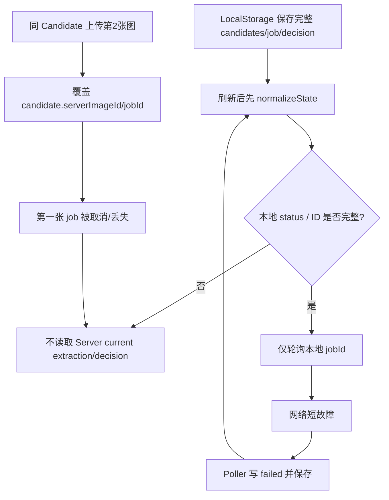

# Server Authority Matrix：前端状态与恢复审查

**审查日期：** 2026-08-08  
**范围：** `app.js`、`frontend/stores.js`、`frontend/api-client.js`、`frontend/job-poller.js`、对应后端读取路由。  
**方法：** 只读代码审查；没有调用真实 Provider、没有修改业务代码、没有读取或记录任何密钥。  
**结论：** 当前浏览器把一份“本地流程快照”当成 Selection 领域的事实来源，而不是把服务端读取结果投影为 UI 状态。这是截图所见的“已完成不显示、删除后候选字母异常、刷新后继续使用过期 Session、候选/图片/任务串线”的共同根因。

---

## 1. 目标权威规则

比赛正常流程必须采用下面的归属，而不是“前端先存一整份业务对象、之后局部补 API”的模式。

| 对象 | 唯一事实来源（目标） | 浏览器可以保存什么 | 浏览器不得拥有或覆盖什么 |
|---|---|---|---|
| `selection_session` | Server | `session_id`、当前未提交的 Need 编辑草稿 | session Need、过期状态、候选集合 |
| `candidate` | Server | 临时显示顺序/当前卡片索引 | 名称、删除结果、服务端 ID、候选总数 |
| `candidate_image` | Server | 尚未上传的 `File`、临时预览 URL | 图片状态、图片数量、服务端图片 ID、当前 Job |
| `analysis_job` | Server | 轮询句柄/当前 polling token | `status`、`error_code`、`extraction_version_id` |
| `extraction_version` | Server | 仅用于缓存渲染的版本 ID | Evidence、completed/stale、当前提取结果 |
| `decision_version` | Server | 当前展示的版本 ID | 排序、候选 Decision、是否 current |
| `questions` | Server | 当前打开的问答面板、未提交文本 | Question 集合、状态、是否仍属于 current Decision |
| `merchant_replies` | Server | 正在输入的草稿（按 question ID） | 已保存回复、解析结果、是否可触发统一复判 |
| 茶仓/泡茶记录（比赛本地版） | Browser adapter（明确例外） | 全部本地茶仓、日记、偏好低置信输入 | 不应伪装成上述 Selection 服务端事实 |

**原则：** 浏览器应只保存“恢复入口 + 未上传文件 + UI 临时状态”。页面恢复时先按 `session_id` 调用 Server，并由返回的 session/candidates/images/jobs/extraction/decision 重新构建视图；LocalStorage 不能直接复写 Server 的领域状态。

---

## 2. 当前 Server Authority Matrix

| 对象 | 现在谁“拥有” | 代码证据 | 漂移/覆盖风险 | 目标归属与修复方向 | 级别 |
|---|---|---|---|---|---|
| `selection_session` | **浏览器快照优先**；Server 只在“开始分析”时局部使用 | `app.js:67-80` 从 `selectionBridge` 重建全局 `state`；`352-371` 仅在已有 `state.sessionId` 后恢复，未先 `GET session` | 已过期/已删除 session 仍可携带候选和 Decision 本地对象。`startMvpAnalysis()` 尝试 `PATCH`，404 后执行 `clearStaleRemoteSelection()`，但重新上传/状态重建依赖本地 File，容易使 UI 显示与 Server 脱节 | Server。启动时先 `GET /selection-sessions/{id}`；404/expired 时原子清除 **全部 server projection**，保留仅未上传本地 File 的明确草稿 | P0 |
| `candidate` | 双写：`state.candidates` + Server | `app.js:138-141` 整个 candidates 数组落 `selectionBridge`；`286-299` 仅在 `serverCandidateId` 空时创建；`1068` 先本地 `splice` 再异步 delete | 本地删除先发生而 Server delete 失败时，刷新会重新用旧本地数组，且没有 server candidates canonical reload。删除后的字母仅本地 `renumberCandidates()`；它没有同步 `display_label` 到 Server | Server。列表、删除、重编号均由 Server result/稳定 ID 驱动；浏览器仅保存 `activeCandidateId`，不要以数组下标作为身份 | P1 |
| `candidate_image` | 双写，但每 Candidate 的 server 指针只有一组 | `app.js:300-308` 每张图片依次上传，却反复写 `candidate.serverImageId` 和 `candidate.jobId`；每张 image 自己有 `serverImageId`，但没有 image 级 Job 字段 | 两张图时第二张覆盖 Candidate 的 `serverImageId/jobId`。恢复、重试、删除只操作最后一张；第一张的 Job/状态可能被忽略。`452-461` 的重传也按单个 `candidate.serverImageId` 删除 | Server，每张 `candidate_image` 有自己的 `id/status/current_job_id`；浏览器维护 `imageId -> jobId` 映射或直接由服务端图片列表投影，不能保留 Candidate 单一 image/job 指针 | **P0** |
| `analysis_job` | Server状态被浏览器局部镜像并可能覆盖 | `app.js:329-350` Poller 回调直接写 `candidate.extractionStatus`；`384-391` 直接写 decision fields；`stores.js:58` 把其所在 candidates/decision job 全量持久化 | 轮询失败被统一伪造为 `{status:'failed'}`（`job-poller.js:25`），网络瞬断会将仍在 Server `processing` 的 Job 错标为 failed。恢复时仅轮询 LocalStorage 记得的 `jobId`；Server 上完成但浏览器没记住的 Job 不会被发现 | Server。Poller 只更新由 Server Job response 指定的 object；网络失败应进入 `poll_retrying/unavailable` UI 状态，不得写成业务 `failed`；恢复需从 Server 列举当前对象/Job | **P0** |
| `extraction_version` | Server有权威接口，但 Browser 依赖本地 status 决定是否读取 | `app.js:340-344` 仅 Job completed 后 `GET current-extraction`；`352-360` 仅当 LocalStorage 说 `completed && !extraction` 才读；`202-215` 直接以响应修改本地 candidate | “Server completed、Browser 仍 queued/failed/没有 jobId”不会读取 Extraction。反之 LocalStorage 旧 `extractionVersionId/extraction` 可继续显示，未验证 Server 是否 stale/current | Server。启动/进入结果页按 candidate 的 current extraction 读取；响应 ID 必须与当前 candidate/image input set 匹配，stale 只能显示为 stale 而非成功 | **P0** |
| `decision_version` | Server输出排序，Browser仍保存并用其控制流程 | `app.js:217-234` 正确按 Server decision 排序；但 `138-141` 持久化 `decisionVersionId/decisionJobId/decisionStatus`；`364-369` 只在本地“没有 candidate.decision”时取 Server current | LocalStorage 有旧 candidate decision 就阻止读取 Server current Decision。补图/删图后仅把 `decisionVersionId=null`（`955,965`），没有清掉 `decisionJobId`、每 candidate `decision` 或显式取消/标 stale，旧结果可能继续主导 UI | Server。以 current decision endpoint 为唯一来源；任意 candidate/image input set 变化时清空本地 projection 并向 Server 取 current/stale 状态，不能仅清一个 ID | **P0** |
| `questions` | Server创建，但 Browser 以数组快照作为是否可答的依据 | `app.js:394-404` 拉取/生成后存 `state.followupQuestions`；`138-141` 直接落 LocalStorage；`406-408` 从该数组找当前 candidate question | Decision 变更/stale 后，旧 questions 可随刷新恢复。不会先验证问题属于 current Decision；current candidate 改变后仅 `find` 第一个同 candidate 问题，无法处理多个字段或明确回答状态 | Server。每次打开问答先按 current decision 查询；Browser只保存草稿，question/reply 状态按 ID 从 Server 渲染 | P1 |
| `merchant_replies` | Server保存，但 Browser没有服务端回复集合模型 | `api-client.js:74-76` 有创建/取单条/立即复判；`app.js:411-415` 创建一条 reply 后立即 rejudge；`selectionBridge` 只保存 `reply` 文本，不保存 reply IDs/状态 | 刷新后看不到已保存回复、也不知道哪一个候选已经答完。单条提交即时复判会更新/替换 Decision，随后其它候选的旧 question 变 stale；不支持“分别保存 → 收齐真正需要的回复 → 一次 aggregate rejudge” | Server。reply 按 `question_id/candidate_id/decision_version_id` 查询并返回状态；浏览器只保存未提交草稿；单独保存后最后统一复判 | **P0** |

---

## 3. 发现的关键断链与代码证据

### P0-1：启动恢复不是 Server-first，导致 LocalStorage 可覆盖真实进度

**证据：**

```js
// app.js:71-75
const ui = GuanchaStores.uiSession.load(uiFallback);
const bridge = GuanchaStores.selectionBridge.load(selectionFallback);
return normalizeState({ ...structuredClone(defaultState), ...ui, ...bridge, ...postPurchase, ... });
```

`selectionBridge` 保存的不只是 session 入口，而是整个 `candidates`、`decisionVersionId`、`followupQuestions`、Job ID 和 Delta（`app.js:138-141`）。随后的 `resumeLiveBackendState()` 并未 `GET selection session` 和 `list candidates`；它仅相信 LocalStorage 中的候选/状态后进行少量补读（`352-371`）。

**用户可见结果：** Server 已完成的图片/提取/判断在刷新后可能一直显示“等待/失败”；已失效的 Session 可能在前端卡片中看起来仍存在；删除候选后本地字母重排但后端身份未同步。

**应改为：** bootstrap 先恢复匿名 `clientId` 和一个轻量 session locator，然后顺序读取 `GET session` → `GET candidates` → 每 candidate 的 images/current extraction/current job → session current decision → current decision questions/replies。读取结果应替换 Selection projection，而不是 merge 到本地旧 objects。

### P0-2：双图模型在前端没有 image 级 Job 身份

**证据：**

```js
// app.js:304-308（循环中的每张图）
const uploaded = await apiClient.uploadCandidateImage(candidate.serverCandidateId, runtime.file);
candidate.serverImageId = uploaded.image.id;
candidate.jobId = uploaded.extraction_job.id;
candidate.images[index] = { ...localImage, serverImageId: uploaded.image.id, ... };
```

一位 Candidate 的第 2 张图片必然覆盖 `candidate.serverImageId` 与 `candidate.jobId`。而轮询又以 Candidate 为资源（`329-336`），因此第二张任务会取消第一张同 Candidate 的 poller（`job-poller.js:12`）。

**用户可见结果：** A1/A2 的上传状态、完成结果或错误会互相覆盖；重传和删除只能作用于最后一次图片；“两张图联合理解”没有可靠客户端输入集。

**应改为：** 每张 `state.candidates[].images[]` 维护 `serverImageId/currentJobId/status`；Server 为同 Candidate 的图片输入集创建一个明确的“联合 Extraction Job”或明确的 input-set version。页面只展示由该联合 ExtractionVersion 指定的 source image IDs。

### P0-3：网络轮询故障被错误写成业务失败

**证据：**

```js
// frontend/job-poller.js:25
.catch((error) => { if (isCurrent()) onUpdate({ status: 'failed', error_code: error.code || 'poll_failed' }); cancel(); });
```

`fetch` 的网络中断、超时、暂时的服务重启与真实 Provider/Job failure 被混为同一个 `failed`。随后 `app.js:338-347` 会持久化该状态。

**用户可见结果：** 用户看到“分析未完成”并以为真实 MiMo/后端失败，之后刷新仍保留 failed；实际 Server 可能已经 completed。

**应改为：** transport/poll 暂时不可达只进入 UI `poll_retrying`，以退避重试或页面恢复时重新读取；只有 Server `GET /jobs/{id}` 返回 terminal `failed` 才写业务失败。

### P0-4：旧 Decision 没有被完整作废，completed 也可能不显示

**证据：**

```js
// app.js:955 与 965
state.decisionVersionId = null;
// candidate.decision 与 state.decisionJobId 未同步清空

// app.js:364
else if (state.decisionVersionId && !state.candidates.some(candidate => candidate.decision)) {
  const decision = await apiClient.getCurrentDecision(state.sessionId);
}
```

补图后还可能保留 candidate 的旧 `decision`，从而阻止对 Server current Decision 的恢复读取。`applySessionDecision()` 按本地 candidates Map 匹配（`217-233`）；如果 LocalStorage 少了/错了 candidate，Server decision 行会被安静丢弃。

**用户可见结果：** 已完成的 Server Decision 不显示；过时判断在结果页继续显示；候选删除/补图后排序异常。

**应改为：** 对任何输入变更建立显式 input-set/version token，统一清除 decision projection、questions 和 rejudge UI；Server 返回 current/stale 状态后重新渲染，不能以本地 `candidate.decision` 作为“是否需要读取”的开关。

### P0-5：商家回复流程无法表达“保存多个回复后统一复判”

**证据：**

```js
// app.js:411-415
const reply = await apiClient.createMerchantReply(...);
const job = await apiClient.rejudgeMerchantReply(state.sessionId, reply.id);
```

同时 API 合同也仅接受一个 `merchant_reply_id`：

```js
// frontend/api-client.js:76
rejudgeMerchantReply: (sessionId, merchantReplyId, ...) =>
  POST /selection-sessions/{sessionId}/rejudge { merchant_reply_id: merchantReplyId }
```

**用户可见结果：** 每答一条即产生新 Decision，其他 Candidate 的 questions 可能转 stale；用户看不到“已保存/待保存/可统一更新判断”的完整状态，造成“提交后没有更新”或“更新后仍是旧判断”的感受。

**应改为：** 将 `POST merchant-replies` 与 `POST aggregate-rejudge` 拆开。前者只保存；后者读取当前 Decision 下全部有效的新 reply，产出 V2 与 Delta。浏览器读取 reply registry 后决定按钮语义，不应猜测。

### P1-1：candidate 删除未取消其 poller，可能回写已移除对象并自动发起错误判断

**证据：** `app.js:1068` 只本地 splice 后 fire-and-forget `apiClient.deleteCandidate()`；没有 `GuanchaJobPoller.cancel(removed.serverCandidateId)`。已有闭包继续引用 `removed` 对象，完成回调仍会调用 `maybeStartSessionDecision()`（`340-344`）。

**影响：** 删除时的旧 Job 可以在后台完成并影响状态保存/自动 Decision。虽不会直接写到其他 Candidate，但会造成错误的 Session 分析启动条件。

### P1-2：ID 作用域与数组下标混用，候选更名/选择状态不稳

**证据：** `activeCandidate` 是 index（`49-50`, `509`），删除时 `splice(Number(target.dataset.index), 1)`（`1068`），`renumberCandidates()` 直接修改 letter/name（`114-122`）。结果页轮播与 `applySessionDecision()` 还会重新排序数组（`229-233`）。

**影响：** 异步任务、删除、排序发生期间，视觉上“当前候选”可能变成另一个对象；应保存 `activeCandidateId` 并在投影更新后按 ID 重新定位。

### P1-3：创建型请求默认每次生成新幂等键，失败重试无法重放同一个写入

**证据：** `api-client.js:47` 对未传 key 的请求调用 `createIdempotencyKey()`；`startMvpAnalysis()` 调用 create session/candidate/upload/analyze 时均未持久化传同一个 key（`286-307`, `377`）。

**影响：** 浏览器在请求已经送达但响应丢失时重试，服务端会视为新创建，触发 Candidate/Image 上限或多个 Job。应以“用户一次意图”为单位保存 idempotency key，直到得到明确成功/冲突。

### P1-4：本地 `File` 与 Server 图片状态混在同一数组，恢复时缺少显式状态机

**证据：** `stageImages()` 同时写 `runtimeImages`、IndexedDB、LocalStorage 元数据（`934-940`）；`restorePendingImages()` 只恢复 `localOnly && !serverImageId`（`124-131`）。`clearStaleRemoteSelection()` 把所有图片标成 `localOnly: true`（`250-255`），即使其本地 Blob 已不在 IndexedDB。

**影响：** Session 过期后，UI 可能显示有可分析图片，实际上传文件已丢失。需要明确 `draft_local / uploading / server_accepted / unavailable_local` 状态，校验以 runtime file 或 server image 来判定。

### P1-5：没有公开的“Session 聚合恢复”合同，前端无法可靠还原 image/job/reply 集合

**证据：** `api-client.js:61-80` 有 Session、candidate list、current extraction/decision、单 Job/reply endpoint，但没有 `list candidate images`、`list active jobs`、`list session merchant replies`。`resumeLiveBackendState()` 因而只能从 LocalStorage 提供的 ID 进行点查。

**影响：** 即使前端改为 Server-first，也没有完整恢复所需的读取合同。需要明确一个不破坏既有 UI 的 read-model（聚合 session snapshot 或补齐列表 endpoint）。

### P2-1：post-purchase 本地数据与 Selection bridge 混在同一 `state`

`warehouse`、`journalRecords` 本来允许本地保存；但它们与 server-owned Selection 对象共享全局 state（`43-64`, `138-141`）。这会扩大 reset/migration 的误伤面。后续可通过独立 repository/adapter 分离，不应阻塞本轮恢复闭环。

### P2-2：`loadState()` 存在 legacy 合并路径

`stores.js:74` 仍读取 `guancha-prototype-v2`，`app.js:77-80` 合并旧对象；历史 schema 容易把示例 Candidate/旧结果带回。应在 server-authority 收口后增加一次受控迁移/清理提示。

---

## 4. “completed 不显示”与“串线”的具体因果链



这不是单个 “图片无法上传” 或 “按钮无法点击” 的点状缺陷，而是**LocalStorage 全量桥接 + Candidate 单 image/job 指针 + 以索引表示当前对象**叠加造成的状态权威冲突。

---

## 5. 建议的 WP1 修复验收（不含实现）

1. 首次加载和刷新只保存 `clientId`、`selectionSessionId`、未上传 File/preview、UI 草稿；不再保存 server-owned candidate/image/job/extraction/decision/question/reply 内容。
2. 新建一个 Server read-model：给定 session ID 一次返回（或可一致地读取）Session、Candidates、Images、current extraction、active Jobs、current Decision、current Questions、saved replies；所有行按 UUID 关联。
3. 前端建立 `hydrateSelectionFromServer(snapshot)`，其唯一职责是替换 Selection projection；所有数组以 `id` 为 identity，`activeCandidateId` 替代 index。
4. 一张图片一个 image-state；同 Candidate 的 1–2 张图片以 Server input set 建立一个联合提取单位。上传、补图、删除均使旧 Extraction/Decision stale，并由 Server 真值返回。
5. Poller 永不把 transport failure 写为 server Job `failed`；仅 Server terminal status 有权写 completed/failed/stale。删除 Candidate/Image 时显式取消相应 polling token。
6. 将商家回复的“保存”与“统一复判”分开；刷新后按 Server reply 状态恢复面板。 

### 最小回归用例

| 用例 | 必须断言 |
|---|---|
| 刷新在 extraction `processing` 时 | 页面从 Server 恢复同一 candidate/image/job，继续轮询，不伪造 failed |
| 刷新在 extraction `completed` 时 | 显示 Server current extraction，含正确 source image IDs |
| A 两图、B 两图、C 一图 | UI/请求均不串 Candidate；A 的联合版本只引用 A1/A2 |
| 删除 A 同时 A job 完成 | A 的旧回调不能写回 state 或启动 Session Decision |
| 补图后旧 Decision | Server current Decision 为 stale/无 current；前端不显示旧排序 |
| 网络暂断但 Job 完成 | UI 显示可重连/恢复；重新连接后 completed，不显示分析失败 |
| 三个 Candidate 分别保存回复 | 每条回复刷新后仍可见；未调用 aggregate rejudge 前 V1 不变；一次 aggregate 后产生 V2 + Delta |

---

## 6. 审查结论

**当前状态：NOT_READY_FOR_FINAL_E2E（仅针对 Runtime & State Authority）。**

- P0：5 项（Server-first 恢复、双图 job 身份、poller 网络失败语义、旧 Decision 失效、回复立即复判）
- P1：5 项（删除取消、index identity、幂等键、File 状态、缺少聚合读取合同）
- P2：2 项（post-purchase 分离、legacy migration）

在 WP1 的 state authority 和读取合同收口前，不建议继续用 UI 截图逐项排错：相同表象会在刷新、网络短断、补图、删除和复判后反复出现。

