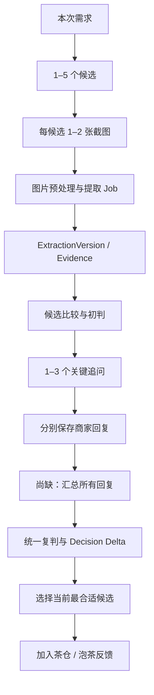

# 观茶比赛版集中审查报告（2026-08-08）

> 状态：待产品决策；本报告是审查结论，不代表所有问题已经修复。
>
> 审查对象：比赛版本地前后端、真实 PostgreSQL `guancha_test`、FakeProvider 闭环、MiMo Vision 手动烟测资产、现有移动端高保真原型。
>
> 安全说明：本文不包含数据库密码、API Key、用户图片二进制或任何私有对象路径。

---

## 1. 结论摘要

项目已经不是“只有原型”的状态。它具备候选上传、图片预处理、异步 Job、结构化 Evidence、候选比较、追问、单条商家回复复判、茶仓和泡茶反馈等多数模块。

当前最大问题是：**这些模块尚未被同一条稳定的浏览器端到端流程约束。** 因此前端本地缓存、后端 PostgreSQL、Fake/真实 Provider 与复判机制会在不同页面中显示不同事实，表现为“界面看起来完成，点击后不能分析或判断不更新”。

比赛演示下一步不应继续补零散页面，而应先收束四件事：

1. 明确 Fake 与真实 MiMo 的运行模式；
2. 让服务器成为会话、候选、图片、Job 与结果的唯一事实来源；
3. 将商家回复改为“分别保存，汇总后统一复判”；
4. 为三候选、双图、追问、回复、复判、茶仓建立一次完整浏览器验收。

---

## 2. 审查依据与优先级

### 2.1 PRD依据

本审查以以下文件为准：

- `观茶_产品PRD_完整机制版_v0.3_2026-08-03.md`
- `观茶_比赛版PRD_茶仓库与泡茶日记_v0.3_最终范围_2026-08-04 (1).md`
- `观茶_黑客松P0后端研发PRD_v1.0_2026-08-04.md`

其中关键约束包括：

```text
1–5 个候选茶
每候选 1–2 张 JPEG/PNG 商品截图
同候选双图联合理解；不同候选独立理解
商品截图 → Evidence → 比较/分档 → 1–3 个追问 → 商家回复 → 复判变化
前端既有页面与视觉体系不应被后端接入顺手重写
商品页声明保持 product-claim / unverified
图片、候选、任务与结果必须有真实状态、失败和恢复处理
```

### 2.2 问题分级

- **P0**：阻断比赛主流程、产生错误结论、误导用户、越权/数据错误或无法演示。
- **P1**：功能可勉强运行，但容易反复出错、状态错误、与 PRD 不一致。
- **P2**：部署、性能、架构整洁度、长期扩展等后续事项。

---

## 3. 当前实际做到哪里

| 流程节点 | 实现情况 | 审查判断 |
| --- | --- | --- |
| 匿名客户端与本次需求 | 已实现 API 与本地桥接 | 可用 |
| 1–5 候选茶 | 已实现候选创建、删除、编号重排 | 可用但状态恢复需收束 |
| 每候选 1–2 张图 | 已实现上传、补图入口、删除、缩略图 | 基础可用，联合理解未充分验收 |
| JPEG/PNG 安全处理 | MIME、签名、解码、EXIF、RGB、缩放、哈希已实现 | 可用 |
| 图片 Job | queued / processing / completed / failed 等状态已实现 | 可用 |
| FakeProvider | 可离线跑通 Extraction 与 Decision | 测试可用，不能作为真实识别演示 |
| MiMo Vision | Adapter 与手动烟测已存在 | 已证明单图/Pilot 可调用，尚未完成浏览器全链路验收 |
| ExtractionVersion 与 Evidence | 已落 PostgreSQL | 可用 |
| 比较与行动分档 | 已实现规则和候选排序 | 规则过于保守，易直接落入“信息不足” |
| 追问 | 已实现问题生成与影响说明 | 可用但后续回复解析覆盖不足 |
| 商家回复与复判 | 已实现单条回复 → 单次复判 | 与当前期望的“汇总复判”不符 |
| 茶仓与泡茶日记 | 已有本地持久化和最小反馈桥接 | 比赛版可演示，非云端账户体系 |

### 当前代码中的主要入口

```text
app.js
  - 浏览器状态、候选卡渲染、上传、轮询、页面跳转、茶仓本地存储

frontend/api-client.js
  - 统一的 X-Client-Id、Idempotency-Key 与后端调用

backend/src/guancha_api/application/phase2_service.py
  - 会话、候选、图片、Job 的应用服务

backend/src/guancha_api/application/decision_service.py
  - 候选比较与 DecisionVersion

backend/src/guancha_api/application/question_service.py
  - 下一最佳问题

backend/src/guancha_api/application/merchant_reply_service.py
  - 商家回复解析与复判

backend/src/guancha_api/repositories/postgres.py
  - PostgreSQL 持久化、幂等、所有权、事务

backend/src/guancha_api/providers/mimo.py
  - MiMo Vision Adapter
```

---

## 4. P0 问题：应先统一解决

### P0-1：Fake 模式被当作真实识别展示

#### 现象

在 `http://127.0.0.1:8001/` 使用 FakeProvider 时，结果出现：

```text
fixture
安溪铁观音
乌龙茶
```

同时，真实截图中的价格、包装规格、红箱/青箱、商品标题等并未提取。

#### 代码证据

`backend/src/guancha_api/main.py` 的 `_provider_from_environment()` 在 `GUANCHA_PROVIDER=fake` 时构造固定样例：

```python
"product_name": "安溪铁观音",
"tea_category": "乌龙茶",
"price": None,
"evidence": [{"raw_text": "fixture", ...}],
```

#### 根因

FakeProvider 的职责是离线测试合同，不是读图。当前启动入口和页面没有把“Fake 演示 / 真实视觉识别”明确区分，导致用户合理地把固定样例当成识别失败。

#### 风险

- 比赛现场会显示无意义的 `fixture`；
- 用户会误认为上传、MiMo 或数据库失效；
- 真实模型与离线测试的结论混杂，无法追溯。

#### 建议

保留 FakeProvider 用于自动测试，但比赛页面只连接“真实 Provider 模式”；页面仅展示“正在识别 / 已识别 / 分析失败”，不展示模型名、供应商或测试占位词。

---

### P0-2：商家回复解析不能处理价格、茶型、退换等真实问题

#### 现象

用户粘贴商家回复后，点击“提交并更新判断”，页面没有新的判断或变化说明。

#### 代码证据

`backend/src/guancha_api/providers/merchant_reply.py` 的 `FakeMerchantReplyReasoningProvider` 当前只匹配极少数字段：

```python
values = {
    "roast_level": [("足火", "heavy"), ("中火", "medium"), ("轻火", "light")],
    "season": [("春茶", "spring"), ("秋茶", "autumn")],
    "sample_available": [("小样", "true"), ("试饮", "true")],
}
```

但 `question_service.py` 会生成如下字段的问题：

```python
"price": "实际到手价格"
"return_policy": "试饮或退换规则"
"origin_text": "具体产地"
"weight_grams": "净含量"
```

对于这些字段，当前解析器会返回 `partially-answered` 或 `not-answered`，不产生可复判 claim。

#### 根因

生成问题与解析回复分别发展，未建立“每个可问字段必须有解析、规范化、证据更新和规则影响”的闭环测试。

#### 建议

统一维护一份字段字典：

```text
字段 → 问题文案 → 可接受回复模式 → 规范化值 → Evidence 字段 → 规则影响
```

比赛版至少覆盖：价格、净含量、焙火/香型、季节、产地、具体茶型、小样/试饮、退换政策。

---

### P0-3：复判范围错误——当前是单条回复即时复判

#### 当前行为

`app.js` 中 `submitMerchantReply()` 的逻辑是：

```javascript
const reply = await apiClient.createMerchantReply(...);
const job = await apiClient.rejudgeMerchantReply(state.sessionId, reply.id);
```

即任意候选的一条回复提交后立即触发复判。

后端 `merchant_reply_service.py` 也是：

```python
rejudge(..., reply_id=reply_id)
```

并基于该 `reply_id` 读取单一回复。

#### 与当前产品决定的冲突

目标流程应是：

```text
候选 A：提交商家回复
候选 B：提交商家回复
候选 C：提交商家回复
全部需要回复的候选完成
→ 提交并更新判断
→ 一次汇总复判
→ 给出当前最合适的一款与变化原因
```

#### 风险

先提交 A 会立即生成一个新 DecisionVersion，B/C 的问题可能随之 stale；用户无法在同一轮中公平比较三款茶。

#### 建议

保持现有 API 路径，但改变语义：

```text
POST merchant-replies：只保存回复
POST rejudge：将 merchant_reply_id 视为本轮触发标记，服务端汇总当前 DecisionVersion 的全部已提交回复
```

前端仅在“所有需要商家回复的候选都已保存”时显示最终“提交并更新判断”。

---

### P0-4：真实浏览器流程没有成为验收门禁

#### 现状

模块测试通过，但用户操作仍发现候选无法分析、上传后未显示、会话不存在、复判无变化等问题。

#### 原因

当前测试以 Repository、ASGI、Provider、规则和前端 API Client 的分段测试为主，没有固定一条浏览器级三候选回归流程。

#### 必须新增的验收流程

```text
创建需求
→ 添加 A/B/C
→ 每款上传 1–2 图
→ 确认所有图片 Job completed
→ 生成初判
→ 生成 1–3 个追问
→ 分别保存商家回复
→ 汇总复判
→ 查看新旧 DecisionVersion 与 Delta
→ 选择当前最合适茶
→ 加入茶仓
→ 刷新后恢复
```

该流程需同时有：Fake 自动回归，以及 MiMo 手动真实烟测。

---

## 5. P1 问题：反复出现的原因

### P1-1：浏览器状态和服务器状态双重存储

#### 本地来源

`app.js` 同时保存：

```javascript
GuanchaStores.uiSession
GuanchaStores.selectionBridge
GuanchaStores.localPostPurchase
GuanchaStores.pendingImages
runtimeImages = new Map()
```

同时服务器还保存：

```text
selection_sessions
candidates
candidate_images
analysis_jobs
extraction_versions
decision_versions
merchant_replies
```

#### 已经反复出现的表现

- 图片显示“已暂存”，但点击分析提示“没有有效图片”；
- 本地仍保存旧 `sessionId`，服务器端已不存在，出现 `selection_session_not_found`；
- 删除候选后编号和本地图片没有同步；
- Job 已完成但页面显示旧状态；
- 缓存旧版 `stores.js` 时上传与页面状态不同。

#### 根因

页面一部分相信 localStorage，一部分相信 IndexedDB，一部分相信 API；刷新和失败恢复没有统一的“以服务器为准”规则。

#### 建议

```text
服务器：会话、候选、图片、Job、Extraction、Decision、回复的唯一事实来源。
浏览器：匿名 Client ID、尚未上传的 File、纯 UI 状态、茶仓演示本地记录。
```

进入候选页后应先尝试恢复服务器资源；本地仅作为上传前草稿和离线兜底，不可覆盖服务器结果。

---

### P1-2：1–2 张图的“联合理解”未被完整验收

PRD要求：同一候选的两张图联合理解，不同候选独立理解。

现有界面已经有小加号和 `1/2`、`2/2` 状态，但需要验证以下事实：

```text
补第二张图
→ 旧 ExtractionVersion 是否 stale
→ 是否建立同候选新 Job
→ Provider 是否收到两张图
→ 新 Evidence 是否能引用正确 source_image_id
→ 旧 Decision 是否 stale，并要求重新比较
```

当前不能仅用“两次图片上传都返回成功”作为合格标准。

---

### P1-3：页面结构被后端接入反复触碰

PRD明确规定：既有页面结构、视觉体系、主要交互不得重写；唯一确定的前端补充是候选卡缩略图右下角的小圆形 `+`。

目前问题不是没有 UI，而是后端接入时在 `app.js` 中同时处理：

```text
状态机 + DOM 渲染 + API + Job 轮询 + localStorage + 图片文件 + 业务判断
```

这使得任何“修上传/修状态”的改动都容易改变候选卡、结果页和商家回复页的视觉行为。

#### 建议

冻结 `styles.css`、SVG 资源和既有渲染结构；只在 `frontend/api-client.js`、适配器、服务端和最小状态桥接处改动。每次接入后做页面截图对照。

---

### P1-4：文档存在互相矛盾的范围声明

例如：

- `docs/CURRENT_STATE.md` 记录了比较、追问、复判、买后桥接已存在；
- `README.md` 仍有“当前不做候选排名、追问、商家复判、泡茶日记”等历史限制。

#### 风险

开发、测试和答辩会引用不同范围；后续修复可能又按旧阶段单候选约束改坏当前 1–5 候选流程。

#### 建议

建立并维护唯一有效的 `docs/CURRENT_STATE.md`；README 只链接该文件，并把旧阶段计划全部标记为历史档案。

---

## 6. P2：不阻断比赛，但需要明确限制

- 本地临时图片存储不适合服务器重启后的持久化；
- 没有真实 Supabase / 云对象存储 / 多设备同步；
- Windows asyncio Selector loop 有 Python 3.16 弃用警告；
- 真实 Provider 的完整浏览器端多候选压力与成本测试未做；
- 现有测试中的部分 asyncio 标记和第三方库存在弃用警告；
- 茶仓是本地比赛版持久化，不是用户账号体系。

这些不应阻止比赛版，但答辩时必须诚实说明。

---

## 7. 已运行的测试与其局限

### 已通过

```text
backend/.venv/Scripts/python.exe -m pytest backend/tests -q
235 passed, 0 failed

node --test frontend/tests/*.test.js
14 passed, 0 failed

test_phase6_merchant_rejudgement.py
4 passed（真实 PostgreSQL）
```

### 不应由上述结果推断为“已完全可演示”

这些测试证明组件大多可工作；不证明：

```text
浏览器状态不会漂移
真实 MiMo 会稳定抽取每一张比赛截图
三候选的商家回复可以汇总复判
真实结果页不会显示 fixture
双图联合理解已经正确完成
```

---

## 8. 建议的集中修复顺序

### 检查点 A：运行模式和真实识别边界

目标：用户永远知道当前是否正在真实识别，页面不再展示 Fake fixture。

验收：

```text
Fake 模式仅用于测试
真实模式由服务端环境变量启用
同一套页面不会混用两种结果
真实模式失败有“重新分析”而不泄漏 Provider 原始错误
```

### 检查点 B：状态所有权与恢复

目标：刷新、删除候选、补图、Job 完成后，前端始终以服务器结果为准。

验收：

```text
不会再出现“已暂存却不可分析”
不会再出现旧 sessionId 导致 selection_session_not_found
候选删除后名称顺序为 A/B/C...
补图和删图都会使旧结果正确失效
```

### 检查点 C：商家回复汇总与统一复判

目标：回复保存与最终复判分离，支持真实字段。

验收：

```text
价格、茶型、焙火、季节、产地、净含量、小样、退换均可解析
每款候选提交回复后只保存，不立即 stale 全部问题
最后一次统一复判汇总全部回复
输出新 DecisionVersion、DecisionDelta、当前相对最适合候选
“结论不变”也是合法结果，必须给出原因
```

### 检查点 D：固定三候选端到端验收

目标：防止已修复的问题再次出现。

验收素材：三组固定商品截图和商家回复文本。

验收输出：浏览器截图、Job 状态、ExtractionVersion、DecisionVersion、Delta、茶仓记录。

---

## 9. 当前流程图



---

## 10. 产品决策待确认项

以下不是技术自行决定的问题，需要产品侧确认后冻结：

1. 比赛现场默认是否一律采用真实 MiMo Vision，而 Fake 只允许测试环境使用？
2. 复判是否以“每候选至少一份回复”为门槛，还是只要求有追问的候选完成回复？
3. 信息不完整时，是否统一显示“当前相对更适合”，并同时显示不确定性，而不再以“无法判断”作为默认终态？
4. 商家回复页是否保持既有视觉，仅修正滚动和动态按钮文案；不新增新页面？
5. 双图是否必须在比赛版真实 Provider 中一次联合发送并重新抽取？

